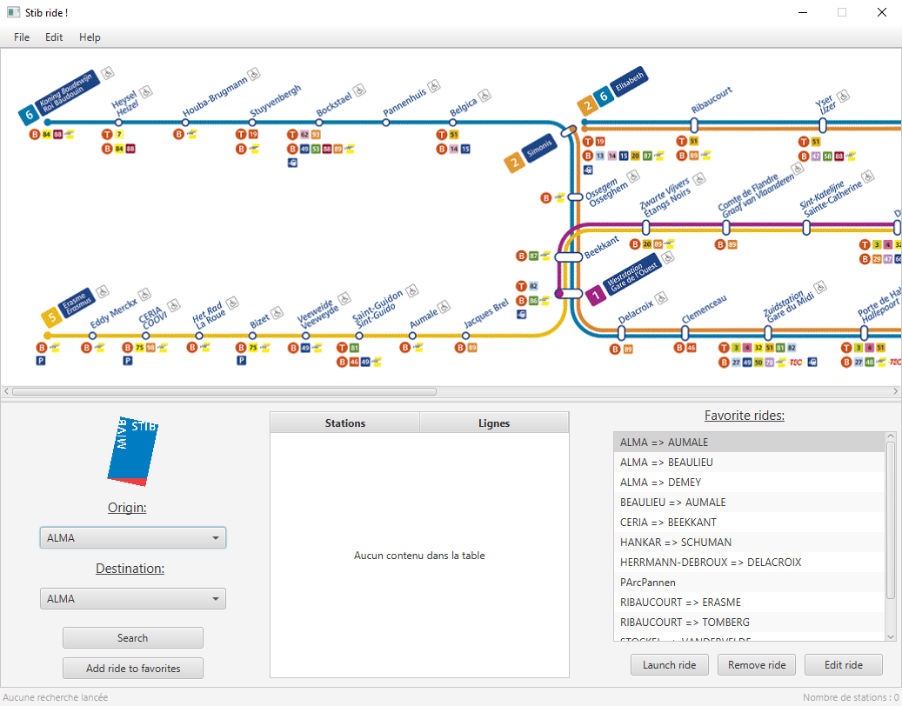

# StibRide

A JavaFX program  that computes the best path between two metro stations in the public transport network of Brussels (STIB/MIVB)

## Author

- Amine-Ayoub Bigham (https://github.com/aabigham)

## About the project

This project was realized in the context of the ATLG4 course of the HE2B - ESI school in brussels.
It involves the use of: 

- the JavaFX technology for the graphical user interface ; 
- the Dijkstra algorithm (shortest path)
- JDBC for database connection ;
- the MVP, Observer, and Repository design patterns 

## Instructions

- Run the project with `mvn javafx:run`

## Screenshot

